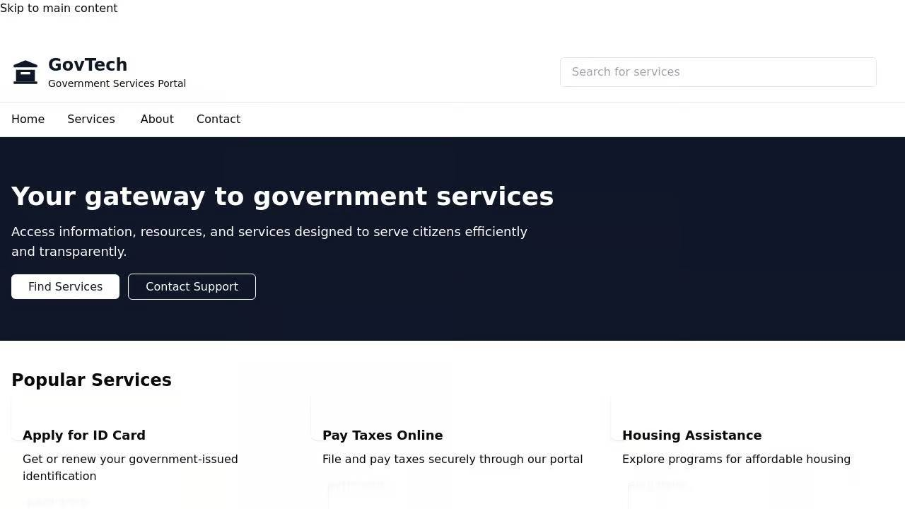

# GovTech Citizen Services Portal

A modern web portal that provides citizens with easy access to government services and information.



## Overview

The GovTech Citizen Services Portal is a comprehensive platform designed to simplify how citizens interact with government services. The portal organizes services by categories and life events, making it intuitive for users to find what they need.

## Features

- **Service Catalog**: Browse all available government services
- **Category-based Navigation**: Find services organized by category (Benefits, Health, Housing, etc.)
- **Life Events Section**: Access services based on life events (Birth, Marriage, Retirement, etc.)
- **Search Functionality**: Quickly find services through the search feature
- **Multilingual Support**: Currently available in English and Spanish
- **News & Updates**: Stay informed about government programs and services
- **FAQs**: Find answers to commonly asked questions
- **Contact Form**: Easily get in touch with government departments

## Tech Stack

- **Frontend**: React with TypeScript, Tailwind CSS, Shadcn UI components
- **State Management**: TanStack Query (React Query) for data fetching
- **Routing**: Wouter for lightweight client-side routing
- **Forms**: React Hook Form with Zod validation
- **Internationalization**: i18next for multilingual support
- **Backend**: Express.js with TypeScript
- **Data Storage**: In-memory storage with simulated persistence (optional database integration available)
- **API**: RESTful API with Zod validation

## Project Structure

```
├── client/                  # Frontend application
│   ├── src/
│   │   ├── components/      # Reusable UI components
│   │   ├── hooks/           # Custom React hooks
│   │   ├── lib/             # Utility functions and configuration
│   │   └── pages/           # Route-specific page components
├── server/                  # Backend application
│   ├── index.ts             # Server entry point
│   ├── routes.ts            # API route definitions
│   ├── storage.ts           # Data storage implementation
│   └── vite.ts              # Vite development server configuration
└── shared/                  # Shared code between client and server
    └── schema.ts            # Data models and validation schemas
```

## Getting Started

### Prerequisites

- Node.js (v16 or higher)
- npm or yarn

### Installation

1. Clone the repository
2. Install dependencies:
```bash
npm install
```

### Running the Application

Start the development server:
```bash
npm run dev
```

This will start both the backend server and the frontend development server.

### Available Scripts

- `npm run dev`: Start the development server
- `npm run build`: Build the application for production
- `npm run start`: Run the production build

## API Endpoints

The application provides the following API endpoints:

- `GET /api/categories`: List all service categories
- `GET /api/categories/:slug`: Get a specific category by slug
- `GET /api/categories/:categoryId/services`: Get services for a specific category
- `GET /api/services`: List all services
- `GET /api/services/popular`: Get popular services
- `GET /api/services/:slug`: Get a specific service by slug
- `GET /api/services/search`: Search for services
- `GET /api/life-events`: List all life events
- `GET /api/life-events/:slug`: Get a specific life event by slug
- `GET /api/faqs`: List all FAQs
- `GET /api/news`: List all news items
- `GET /api/news/:slug`: Get a specific news item by slug
- `POST /api/contact`: Submit a contact form

## Customization

### Adding New Services

To add new services, you can use the provided API endpoints or modify the initial data in the `storage.ts` file.

### Theming

The application uses Tailwind CSS for styling. You can customize the theme by modifying the `tailwind.config.js` and `theme.json` files.

## Contributing

Contributions are welcome! Please feel free to submit a Pull Request.

## License

This project is licensed under the MIT License - see the LICENSE file for details.

habizinnia@gmail.com